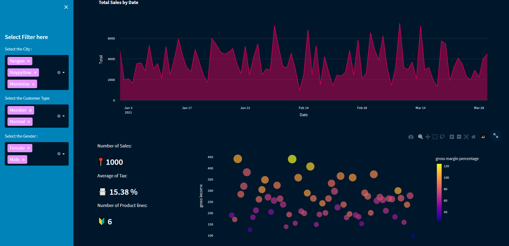

## :bar_chart: Interactive Sales Dashboard with python - streamlit

---

#### :memo: Install requirements
```shell
pip install -r requirements.txt
```

### :white_check_mark: Run the App
```shell
streamlit run main.py

#quit 
ctrl-c
```
runs on `http://localhost:8501`

### :red_circle: Demo 
sales dashboard  https://abdelghafourbamoula.me/

### screenshot


---


